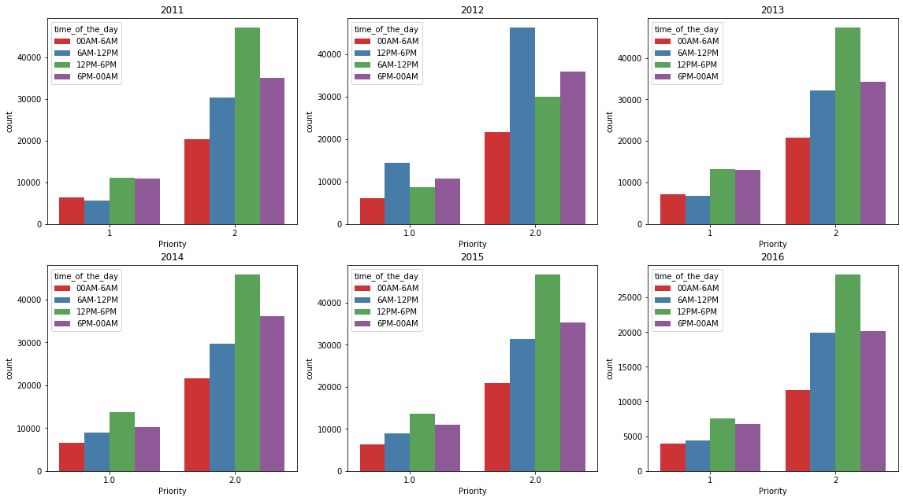

# Oakland Crime Statistics 2011 to 2016 


```python
import numpy as np # linear algebra
import pandas as pd # data processing, CSV file I/O (e.g. pd.read_csv)
import seaborn as sns
import json
import ast
import datetime as dt
from dateutil import tz
from dateutil import parser
import matplotlib.pyplot as plt
import time

# Input data files are available in the "../input/" directory.
# For example, running this (by clicking run or pressing Shift+Enter) will list the files in the input directory

import os
print('\n'.join(os.listdir("./oakland-crime-statistics-2011-to-2016/")))
```

    socrata_metadata_records-for-2011.json
    socrata_metadata_records-for-2016.json
    socrata_metadata_records-for-2014.json
    socrata_metadata_records-for-2015.json
    socrata_metadata_records-for-2012.json
    records-for-2016.csv
    records-for-2014.csv
    records-for-2015.csv
    records-for-2011.csv
    records-for-2012.csv
    socrata_metadata_records-for-2013.json
    records-for-2013.csv


## 数据预处理

首先对数据进行预处理，将时间的换算成秒，将时间划分成几个时间段，并且将数据中的空值直接去除。


```python
intervals = (
    ('weeks', 604800),  # 60 * 60 * 24 * 7
    ('days', 86400),    # 60 * 60 * 24
    ('hours', 3600),    # 60 * 60
    ('minutes', 60),
    ('seconds', 1),
    )


def get_nlargest_incident_id(n, df):
    return df.groupby(by="Incident Type Id",sort=True, as_index=False).count().nlargest(n, 'Create Time')["Incident Type Id"].values
def get_nlargest_area_id(n, df):
    return df.groupby(by="Area Id",sort=True, as_index=False).count().nlargest(n, 'Create Time')["Area Id"].values
def display_time(seconds, granularity=10):
    result = []

    for name, count in intervals:
        value = seconds // count
        if value:
            seconds -= value * count
            if value == 1:
                name = name.rstrip('s')
            result.append("{} {}".format(value, name))
    return ', '.join(result[:granularity])

def map_x(x):
    if x.hour < 6:
        return "00AM-6AM"
    if x.hour < 12 and x.hour > 6:
        return "6AM-12PM"
    if x.hour >= 12 and x.hour<18:
        return "12PM-6PM"
    if x.hour > 18:
        return "6PM-00AM"
    
def prep_data(df):
    df['Create Time'] = df['Create Time'].fillna(df['Closed Time'])
    df['Closed Time'] = df['Closed Time'].fillna(df['Create Time'])
    df["time_between_creation_and_closed_seconds"] = df.apply(lambda x: abs((parser.parse(x["Closed Time"]) - parser.parse(x["Create Time"])).seconds), axis=1)
    df["time_of_the_day"] = df["Create Time"].map(lambda x:map_x(parser.parse(x)))
    df.replace(r'', np.nan, regex=True, inplace=True)
    df["Area Id"].fillna(-1, inplace=True)
    df["Beat"].fillna("Unknown", inplace=True)
    df["Priority"].fillna("-1", inplace=True)
    df["Priority"].astype(int)
    df.drop(["Agency", "Event Number"], inplace=True, axis=1)
    df["day_of_the_month"] = df["Create Time"].apply(lambda x: parser.parse(x).day)
    df["day_of_the_week"] = df["day_of_the_month"].apply(lambda x: (x % 7) + 1)
    df["month_of_the_year"] = df["Create Time"].apply(lambda x: parser.parse(x).month)
    return df
```


```python

# 五数分布


def fiveNumber(nums):
        # 五数概括 Minimum（最小值）、Q1、Median（中位数、）、Q3、Maximum（最大值）
    Minimum = min(nums)
    Maximum = max(nums)
    Q1 = np.percentile(nums, 25)
    Median = np.median(nums)
    Q3 = np.percentile(nums, 75)

    IQR = Q3-Q1
    lower_limit = Q1-1.5*IQR  # 下限值
    upper_limit = Q3+1.5*IQR  # 上限值

    return Minimum, Q1, Median, Q3, Maximum, lower_limit, upper_limit


def printfiveNumber(fivenumber):
    print("+++++++++++++++")
    print(f"Min = {fivenumber[0]}")
    print(f"Q1  = {fivenumber[1]}")
    print(f"Median = {fivenumber[2]}")
    print(f"Q3 = {fivenumber[3]}")
    print(f"Max = {fivenumber[4]}")
    print(f"lower_limit = {fivenumber[5]}")
    print(f"upper_limit = {fivenumber[6]}")
    print("+++++++++++++++")
```

## 导入数据


- 2011年数据


```python
crimes_2011 = pd.read_csv("./oakland-crime-statistics-2011-to-2016/records-for-2011.csv")
crimes_2011.drop(index=[180015], inplace=True)
crimes_2011 = prep_data(crimes_2011)
crimes_2011.rename(index=str, columns={"Location": "address"}, inplace=True)
crimes_2011["Priority"].replace(0.0, 1.0, inplace=True)
crimes_2011["Priority"] = crimes_2011["Priority"].astype(int)
crimes_2011.head(2)
```


<div>
<style scoped>
    .dataframe tbody tr th:only-of-type {
        vertical-align: middle;
    }

    .dataframe tbody tr th {
        vertical-align: top;
    }

    .dataframe thead th {
        text-align: right;
    }
</style>
<table border="1" class="dataframe">
  <thead>
    <tr style="text-align: right;">
      <th></th>
      <th>Create Time</th>
      <th>address</th>
      <th>Area Id</th>
      <th>Beat</th>
      <th>Priority</th>
      <th>Incident Type Id</th>
      <th>Incident Type Description</th>
      <th>Closed Time</th>
      <th>time_between_creation_and_closed_seconds</th>
      <th>time_of_the_day</th>
      <th>day_of_the_month</th>
      <th>day_of_the_week</th>
      <th>month_of_the_year</th>
    </tr>
  </thead>
  <tbody>
    <tr>
      <td>0</td>
      <td>2011-01-01T00:00:00.000</td>
      <td>ST&amp;SAN PABLO AV</td>
      <td>1.0</td>
      <td>06X</td>
      <td>1</td>
      <td>PDOA</td>
      <td>POSSIBLE DEAD PERSON</td>
      <td>2011-01-01T00:28:17.000</td>
      <td>1697</td>
      <td>00AM-6AM</td>
      <td>1</td>
      <td>2</td>
      <td>1</td>
    </tr>
    <tr>
      <td>1</td>
      <td>2011-01-01T00:01:11.000</td>
      <td>ST&amp;HANNAH ST</td>
      <td>1.0</td>
      <td>07X</td>
      <td>1</td>
      <td>415GS</td>
      <td>415 GUNSHOTS</td>
      <td>2011-01-01T01:12:56.000</td>
      <td>4305</td>
      <td>00AM-6AM</td>
      <td>1</td>
      <td>2</td>
      <td>1</td>
    </tr>
  </tbody>
</table>
</div>


- 2012年数据


```python
crimes_2012 = pd.read_csv("./oakland-crime-statistics-2011-to-2016/records-for-2012.csv")
crimes_2012.dropna(thresh=9, inplace=True)
crimes_2012 = prep_data(crimes_2012)
crimes_2012.rename(index=str, columns={"Location ": "address"}, inplace=True)
crimes_2012["Area Id"] = crimes_2012["Area Id"].astype(int)
crimes_2012["Priority"].replace(0.0, 1.0, inplace=True)
crimes_2012["Priority"] = crimes_2012["Priority"].astype(int)
crimes_2012.head(2)
```


<div>
<style scoped>
    .dataframe tbody tr th:only-of-type {
        vertical-align: middle;
    }

    .dataframe tbody tr th {
        vertical-align: top;
    }

    .dataframe thead th {
        text-align: right;
    }
</style>
<table border="1" class="dataframe">
  <thead>
    <tr style="text-align: right;">
      <th></th>
      <th>Create Time</th>
      <th>Area Id</th>
      <th>Beat</th>
      <th>Priority</th>
      <th>Incident Type Id</th>
      <th>Incident Type Description</th>
      <th>Closed Time</th>
      <th>Location 1</th>
      <th>Zip Codes</th>
      <th>time_between_creation_and_closed_seconds</th>
      <th>time_of_the_day</th>
      <th>day_of_the_month</th>
      <th>day_of_the_week</th>
      <th>month_of_the_year</th>
    </tr>
  </thead>
  <tbody>
    <tr>
      <td>0</td>
      <td>2012-01-01T00:00:25.000</td>
      <td>2</td>
      <td>32Y</td>
      <td>2</td>
      <td>415GS</td>
      <td>415 GUNSHOTS</td>
      <td>2012-01-01T00:40:27.000</td>
      <td>{'human_address': '{"address": "OLIVE ST", "ci...</td>
      <td>NaN</td>
      <td>2402</td>
      <td>00AM-6AM</td>
      <td>1</td>
      <td>2</td>
      <td>1</td>
    </tr>
    <tr>
      <td>1</td>
      <td>2012-01-01T00:00:27.000</td>
      <td>2</td>
      <td>30Y</td>
      <td>2</td>
      <td>415GS</td>
      <td>415 GUNSHOTS</td>
      <td>2012-01-01T01:34:31.000</td>
      <td>{'human_address': '{"address": "AV&amp;MACARTHUR B...</td>
      <td>NaN</td>
      <td>5644</td>
      <td>00AM-6AM</td>
      <td>1</td>
      <td>2</td>
      <td>1</td>
    </tr>
  </tbody>
</table>
</div>


- 2013年数据


```python
crimes_2013 = pd.read_csv("./oakland-crime-statistics-2011-to-2016/records-for-2013.csv")
crimes_2013.dropna(thresh=9, inplace=True)
crimes_2013 = prep_data(crimes_2013)
crimes_2013.rename(index=str, columns={"Location ": "address"}, inplace=True)
crimes_2013["Area Id"] = crimes_2013["Area Id"].astype(int)
crimes_2013["Priority"].replace(0.0, 1.0, inplace=True)
crimes_2013["Priority"] = crimes_2013["Priority"].astype(int)
crimes_2013.head(2)

```


<div>
<style scoped>
    .dataframe tbody tr th:only-of-type {
        vertical-align: middle;
    }

    .dataframe tbody tr th {
        vertical-align: top;
    }

    .dataframe thead th {
        text-align: right;
    }
</style>
<table border="1" class="dataframe">
  <thead>
    <tr style="text-align: right;">
      <th></th>
      <th>Create Time</th>
      <th>address</th>
      <th>Area Id</th>
      <th>Beat</th>
      <th>Priority</th>
      <th>Incident Type Id</th>
      <th>Incident Type Description</th>
      <th>Closed Time</th>
      <th>time_between_creation_and_closed_seconds</th>
      <th>time_of_the_day</th>
      <th>day_of_the_month</th>
      <th>day_of_the_week</th>
      <th>month_of_the_year</th>
    </tr>
  </thead>
  <tbody>
    <tr>
      <td>0</td>
      <td>2013-01-01T00:00:00.000</td>
      <td>D ST</td>
      <td>2</td>
      <td>33X</td>
      <td>1</td>
      <td>415GS</td>
      <td>415 GUNSHOTS</td>
      <td>2013-01-01T00:47:51.000</td>
      <td>2871</td>
      <td>00AM-6AM</td>
      <td>1</td>
      <td>2</td>
      <td>1</td>
    </tr>
    <tr>
      <td>1</td>
      <td>2013-01-01T00:00:05.000</td>
      <td>ARTHUR ST</td>
      <td>2</td>
      <td>30X</td>
      <td>2</td>
      <td>415GS</td>
      <td>415 GUNSHOTS</td>
      <td>2013-01-01T01:30:58.000</td>
      <td>5453</td>
      <td>00AM-6AM</td>
      <td>1</td>
      <td>2</td>
      <td>1</td>
    </tr>
  </tbody>
</table>
</div>


- 2014年数据


```python
crimes_2014 = pd.read_csv("./oakland-crime-statistics-2011-to-2016/records-for-2014.csv")
crimes_2014.dropna(thresh=9, inplace=True)
crimes_2014 = prep_data(crimes_2014)
crimes_2014.rename(index=str, columns={"Location ": "address"}, inplace=True)
crimes_2014["Area Id"] = crimes_2013["Area Id"].astype(int)
crimes_2014["Priority"].replace(0.0, 1.0, inplace=True)
crimes_2014["Priority"] = crimes_2013["Priority"].astype(int)
crimes_2014.head(2)
```


<div>
<style scoped>
    .dataframe tbody tr th:only-of-type {
        vertical-align: middle;
    }

    .dataframe tbody tr th {
        vertical-align: top;
    }

    .dataframe thead th {
        text-align: right;
    }
</style>
<table border="1" class="dataframe">
  <thead>
    <tr style="text-align: right;">
      <th></th>
      <th>Create Time</th>
      <th>Area Id</th>
      <th>Beat</th>
      <th>Priority</th>
      <th>Incident Type Id</th>
      <th>Incident Type Description</th>
      <th>Closed Time</th>
      <th>Location 1</th>
      <th>Zip Codes</th>
      <th>time_between_creation_and_closed_seconds</th>
      <th>time_of_the_day</th>
      <th>day_of_the_month</th>
      <th>day_of_the_week</th>
      <th>month_of_the_year</th>
    </tr>
  </thead>
  <tbody>
    <tr>
      <td>0</td>
      <td>2014-01-01T00:00:00.000</td>
      <td>2.0</td>
      <td>02X</td>
      <td>1.0</td>
      <td>415GS</td>
      <td>415 GUNSHOTS</td>
      <td>2014-01-01T03:22:08.000</td>
      <td>{'human_address': '{"address": "LINDEN ST", "c...</td>
      <td>NaN</td>
      <td>12128</td>
      <td>00AM-6AM</td>
      <td>1</td>
      <td>2</td>
      <td>1</td>
    </tr>
    <tr>
      <td>1</td>
      <td>2014-01-01T00:00:00.000</td>
      <td>2.0</td>
      <td>26Y</td>
      <td>2.0</td>
      <td>415GS</td>
      <td>415 GUNSHOTS</td>
      <td>2014-01-01T02:56:31.000</td>
      <td>{'human_address': '{"address": "AV&amp;INTERNATION...</td>
      <td>NaN</td>
      <td>10591</td>
      <td>00AM-6AM</td>
      <td>1</td>
      <td>2</td>
      <td>1</td>
    </tr>
  </tbody>
</table>
</div>


- 2015年数据


```python
crimes_2015 = pd.read_csv("./oakland-crime-statistics-2011-to-2016/records-for-2015.csv")
crimes_2015.dropna(thresh=9, inplace=True)
crimes_2015 = prep_data(crimes_2015)
crimes_2015.rename(index=str, columns={"Location ": "address"}, inplace=True)
crimes_2015["Area Id"] = crimes_2013["Area Id"].astype(int)
crimes_2015["Priority"].replace(0.0, 1.0, inplace=True)
crimes_2015["Priority"] = crimes_2013["Priority"].astype(int)
crimes_2015.head(2)
```


<div>
<style scoped>
    .dataframe tbody tr th:only-of-type {
        vertical-align: middle;
    }

    .dataframe tbody tr th {
        vertical-align: top;
    }

    .dataframe thead th {
        text-align: right;
    }
</style>
<table border="1" class="dataframe">
  <thead>
    <tr style="text-align: right;">
      <th></th>
      <th>Create Time</th>
      <th>Location</th>
      <th>Area Id</th>
      <th>Beat</th>
      <th>Priority</th>
      <th>Incident Type Id</th>
      <th>Incident Type Description</th>
      <th>Closed Time</th>
      <th>time_between_creation_and_closed_seconds</th>
      <th>time_of_the_day</th>
      <th>day_of_the_month</th>
      <th>day_of_the_week</th>
      <th>month_of_the_year</th>
    </tr>
  </thead>
  <tbody>
    <tr>
      <td>0</td>
      <td>2015-01-01T00:01:59.000</td>
      <td>S ELMHURST AV</td>
      <td>2.0</td>
      <td>31Y</td>
      <td>1.0</td>
      <td>415</td>
      <td>DISTURBING THE PEACE</td>
      <td>2015-01-01T06:23:08.000</td>
      <td>22869</td>
      <td>00AM-6AM</td>
      <td>1</td>
      <td>2</td>
      <td>1</td>
    </tr>
    <tr>
      <td>1</td>
      <td>2015-01-01T00:02:02.000</td>
      <td>AV&amp;D ST</td>
      <td>2.0</td>
      <td>32X</td>
      <td>2.0</td>
      <td>415GS</td>
      <td>415 GUNSHOTS</td>
      <td>2015-01-01T01:44:40.000</td>
      <td>6158</td>
      <td>00AM-6AM</td>
      <td>1</td>
      <td>2</td>
      <td>1</td>
    </tr>
  </tbody>
</table>
</div>


- 2016年数据


```python
crimes_2016 = pd.read_csv("./oakland-crime-statistics-2011-to-2016/records-for-2016.csv")
crimes_2016.dropna(thresh=9, inplace=True)
crimes_2016 = prep_data(crimes_2016)
crimes_2016.rename(index=str, columns={"Location": "address"}, inplace=True)
crimes_2016["Priority"] = crimes_2016["Priority"].astype(int)
crimes_2016.head(2)
```


<div>
<style scoped>
    .dataframe tbody tr th:only-of-type {
        vertical-align: middle;
    }

    .dataframe tbody tr th {
        vertical-align: top;
    }

    .dataframe thead th {
        text-align: right;
    }
</style>
<table border="1" class="dataframe">
  <thead>
    <tr style="text-align: right;">
      <th></th>
      <th>Create Time</th>
      <th>address</th>
      <th>Area Id</th>
      <th>Beat</th>
      <th>Priority</th>
      <th>Incident Type Id</th>
      <th>Incident Type Description</th>
      <th>Closed Time</th>
      <th>time_between_creation_and_closed_seconds</th>
      <th>time_of_the_day</th>
      <th>day_of_the_month</th>
      <th>day_of_the_week</th>
      <th>month_of_the_year</th>
    </tr>
  </thead>
  <tbody>
    <tr>
      <td>0</td>
      <td>2016-01-01T00:00:57.000</td>
      <td>ST&amp;MARKET ST</td>
      <td>P1</td>
      <td>05X</td>
      <td>2</td>
      <td>415GS</td>
      <td>415 GUNSHOTS</td>
      <td>2016-01-01T00:32:30.000</td>
      <td>1893</td>
      <td>00AM-6AM</td>
      <td>1</td>
      <td>2</td>
      <td>1</td>
    </tr>
    <tr>
      <td>1</td>
      <td>2016-01-01T00:01:25.000</td>
      <td>AV&amp;HAMILTON ST</td>
      <td>P3</td>
      <td>26Y</td>
      <td>2</td>
      <td>415GS</td>
      <td>415 GUNSHOTS</td>
      <td>2016-01-01T00:48:23.000</td>
      <td>2818</td>
      <td>00AM-6AM</td>
      <td>1</td>
      <td>2</td>
      <td>1</td>
    </tr>
  </tbody>
</table>
</div>


## 数据可视化和摘要


### 犯罪持续时间五数分布


```python
print("五数分析")
for i, crime_year in enumerate(crimes_list):
    five = fiveNumber(crime_year[crime_year["Priority"] == 1]["time_between_creation_and_closed_seconds"])
    print(str(2011+i)+"time_between_creation_and_closed_seconds")
    printfiveNumber(five)
```

    五数分析
    2011time_between_creation_and_closed_seconds
    +++++++++++++++
    Min = 0
    Q1  = 1379.0
    Median = 3393.0
    Q3 = 7047.0
    Max = 86241
    lower_limit = -7123.0
    upper_limit = 15549.0
    +++++++++++++++
    2012time_between_creation_and_closed_seconds
    +++++++++++++++
    Min = 0
    Q1  = 1396.25
    Median = 3890.0
    Q3 = 8941.0
    Max = 86343
    lower_limit = -9920.875
    upper_limit = 20258.125
    +++++++++++++++
    2013time_between_creation_and_closed_seconds
    +++++++++++++++
    Min = 0
    Q1  = 1635.0
    Median = 4024.0
    Q3 = 8136.0
    Max = 86388
    lower_limit = -8116.5
    upper_limit = 17887.5
    +++++++++++++++
    2014time_between_creation_and_closed_seconds
    +++++++++++++++
    Min = 0
    Q1  = 1500.0
    Median = 4304.0
    Q3 = 10436.0
    Max = 86399
    lower_limit = -11904.0
    upper_limit = 23840.0
    +++++++++++++++
    2015time_between_creation_and_closed_seconds
    +++++++++++++++
    Min = 0
    Q1  = 1313.0
    Median = 3976.5
    Q3 = 9604.25
    Max = 86399
    lower_limit = -11123.875
    upper_limit = 22041.125
    +++++++++++++++
    2016time_between_creation_and_closed_seconds
    +++++++++++++++
    Min = 0
    Q1  = 1541.5
    Median = 3830.0
    Q3 = 8049.0
    Max = 86399
    lower_limit = -8219.75
    upper_limit = 17810.25
    +++++++++++++++


### 犯罪处理时间随时间的变化


```python
def box_plot(all_data):
#     all_data = np.array(all_data)
    fig = plt.figure(figsize=(16,8))

    plt.boxplot(all_data,notch=False, sym='o',vert=True)   # vertical box aligmnent  # vertical box aligmnent
    year_list = []
    for i in range(2011,2017):
        year_list.append(str(i))
    plt.xticks([i for i in range(1,7)],year_list)
#     plt.xlabel('measurement x')
    t = plt.title('Box plot')
    plt.show()
```

### 每年犯罪持续时间盒图


```python
box = []
for crime_year in crimes_list:
    plt.subplots_adjust(left=0, right=2.5, top=3, bottom=1)
    box.append(crime_year["time_between_creation_and_closed_seconds"])
# box = box.transpose()
print(np.shape(box))
#         plt.boxplot(box,notch=False, sym='o',vert=True)   # vertical box aligmnent  # vertical box aligmnent
#         plot.show()
    
box_plot(box)

```

    (6,)


    <Figure size 432x288 with 0 Axes>


### beats的频数统计


```python

fig, ax = plt.subplots(nrows=2, ncols=3)
plt.subplots_adjust(left=0, right=2.5, top=3, bottom=1)
i = 0
for row in ax:
    for col in row:
        col.set_title(str(2011 + i))
        #sns.countplot(data=crimes_list[i].loc[crimes_list[i]['Incident Type Id'].isin(nlargest[i])], x="Incident Type Id", hue="Priority", palette="Set1", ax=col)
        temp = crimes_list[i].groupby(by=["Beat", "Priority"],sort=True, as_index=False).count().rename(index=str, columns={"Create Time": "Count"})[["Beat", "Priority", "Count", "time_of_the_day"]]
        beats_prio_1 = list(temp[temp["Priority"] == 1].nlargest(5, "Count")["Beat"].values)
        beats_prio_2 = list(temp[temp["Priority"] == 2].nlargest(5, "Count")["Beat"].values)
        print("Year " + str(2011 +i ) +":\n")
        print("The Beats With the Most Reports (Priority 1, Decending Order): {} \nThe Beats With the Most Reports (Priority 2, Decending Order): {} \nUnique Beats: {}".format(str(beats_prio_1), str(beats_prio_2), str(list(set(beats_prio_1)|set(beats_prio_2)))))
        print("Common Beats: {}".format(str(list(set(beats_prio_1) & set(beats_prio_2)))))
        sns.barplot(data=temp[temp["Beat"].isin(beats_prio_1 + beats_prio_2)], x="Beat", y="Count", hue="Priority",palette="Set1", ax=col)
        print("=======================================================================================\n")
        i += 1

```

    Year 2011:
    
    The Beats With the Most Reports (Priority 1, Decending Order): ['04X', '26Y', '08X', '06X', '34X'] 
    The Beats With the Most Reports (Priority 2, Decending Order): ['04X', '08X', '30Y', '26Y', '19X'] 
    Unique Beats: ['04X', '26Y', '30Y', '19X', '06X', '34X', '08X']
    Common Beats: ['04X', '08X', '26Y']
    =======================================================================================
    
    Year 2012:
    
    The Beats With the Most Reports (Priority 1, Decending Order): ['04X', '08X', '26Y', '30Y', '23X'] 
    The Beats With the Most Reports (Priority 2, Decending Order): ['04X', '08X', '30Y', '23X', '26Y'] 
    Unique Beats: ['04X', '26Y', '30Y', '23X', '08X']
    Common Beats: ['04X', '30Y', '26Y', '23X', '08X']
    =======================================================================================
    
    Year 2013:
    
    The Beats With the Most Reports (Priority 1, Decending Order): ['04X', '08X', '34X', '26Y', '30X'] 
    The Beats With the Most Reports (Priority 2, Decending Order): ['04X', '08X', '30Y', '30X', '19X'] 
    Unique Beats: ['04X', '30X', '26Y', '30Y', '19X', '34X', '08X']
    Common Beats: ['04X', '30X', '08X']
    =======================================================================================
    
    Year 2014:
    
    The Beats With the Most Reports (Priority 1, Decending Order): ['04X', '08X', '30Y', '26Y', '30X'] 
    The Beats With the Most Reports (Priority 2, Decending Order): ['04X', '08X', '30X', '23X', '30Y'] 
    Unique Beats: ['04X', '30X', '30Y', '26Y', '23X', '08X']
    Common Beats: ['04X', '30X', '08X', '30Y']
    =======================================================================================
    
    Year 2015:
    
    The Beats With the Most Reports (Priority 1, Decending Order): ['04X', '08X', '19X', '23X', '30X'] 
    The Beats With the Most Reports (Priority 2, Decending Order): ['04X', '08X', '30Y', '30X', '19X'] 
    Unique Beats: ['04X', '30X', '30Y', '19X', '23X', '08X']
    Common Beats: ['04X', '30X', '08X', '19X']
    =======================================================================================
    
    Year 2016:
    
    The Beats With the Most Reports (Priority 1, Decending Order): ['04X', '26Y', '30X', '30Y', '08X'] 
    The Beats With the Most Reports (Priority 2, Decending Order): ['04X', '08X', '19X', '30Y', '26Y'] 
    Unique Beats: ['04X', '30X', '26Y', '30Y', '19X', '08X']
    Common Beats: ['04X', '08X', '30Y', '26Y']
    =======================================================================================
    


### 每年的报警数量


```python
fig, ax = plt.subplots(nrows=2, ncols=3)
plt.subplots_adjust(left=0, right=2.5, top=3, bottom=1)
crimes_list = [crimes_2011, crimes_2012, crimes_2013, crimes_2014, crimes_2015, crimes_2016]
i = 0
for row in ax:
    for col in row:
        col.set_title(str(2011 + i))
        sns.countplot(data=crimes_list[i], x="Priority", ax=col, palette="Set1")
        i+=1
```


### 每年报警的时间段分布


```python
fig, ax = plt.subplots(nrows=2, ncols=3)
plt.subplots_adjust(left=0, right=2.5, top=3, bottom=1)
i = 0
for row in ax:
    for col in row:
        col.set_title(str(2011 + i))
        sns.countplot(data=crimes_list[i], x="Priority", hue="time_of_the_day", palette="Set1", ax=col)
        i+=1
```





从上述的图中可以看出优先级为1的案件少，优先级为2的案件多，案件的高发时间段为12PM-6PM

## 缺失数据的处理


```python
crimes_2011_miss = pd.read_csv("./oakland-crime-statistics-2011-to-2016/records-for-2011.csv", keep_default_na=False)
crimes_2011_miss.head(2)
```

    /Users/zhangbo/Library/Python/3.7/lib/python/site-packages/IPython/core/interactiveshell.py:3058: DtypeWarning: Columns (5) have mixed types. Specify dtype option on import or set low_memory=False.
      interactivity=interactivity, compiler=compiler, result=result)


<div>
<style scoped>
    .dataframe tbody tr th:only-of-type {
        vertical-align: middle;
    }

    .dataframe tbody tr th {
        vertical-align: top;
    }

    .dataframe thead th {
        text-align: right;
    }
</style>
<table border="1" class="dataframe">
  <thead>
    <tr style="text-align: right;">
      <th></th>
      <th>Agency</th>
      <th>Create Time</th>
      <th>Location</th>
      <th>Area Id</th>
      <th>Beat</th>
      <th>Priority</th>
      <th>Incident Type Id</th>
      <th>Incident Type Description</th>
      <th>Event Number</th>
      <th>Closed Time</th>
    </tr>
  </thead>
  <tbody>
    <tr>
      <td>0</td>
      <td>OP</td>
      <td>2011-01-01T00:00:00.000</td>
      <td>ST&amp;SAN PABLO AV</td>
      <td>1</td>
      <td>06X</td>
      <td>1</td>
      <td>PDOA</td>
      <td>POSSIBLE DEAD PERSON</td>
      <td>LOP110101000001</td>
      <td>2011-01-01T00:28:17.000</td>
    </tr>
    <tr>
      <td>1</td>
      <td>OP</td>
      <td>2011-01-01T00:01:11.000</td>
      <td>ST&amp;HANNAH ST</td>
      <td>1</td>
      <td>07X</td>
      <td>1</td>
      <td>415GS</td>
      <td>415 GUNSHOTS</td>
      <td>LOP110101000002</td>
      <td>2011-01-01T01:12:56.000</td>
    </tr>
  </tbody>
</table>
</div>


```python
crimes_2012_miss = pd.read_csv("./oakland-crime-statistics-2011-to-2016/records-for-2012.csv", keep_default_na=False)
crimes_2012_miss.head(2)
```

    /Users/zhangbo/Library/Python/3.7/lib/python/site-packages/IPython/core/interactiveshell.py:3058: DtypeWarning: Columns (4) have mixed types. Specify dtype option on import or set low_memory=False.
      interactivity=interactivity, compiler=compiler, result=result)


<div>
<style scoped>
    .dataframe tbody tr th:only-of-type {
        vertical-align: middle;
    }

    .dataframe tbody tr th {
        vertical-align: top;
    }

    .dataframe thead th {
        text-align: right;
    }
</style>
<table border="1" class="dataframe">
  <thead>
    <tr style="text-align: right;">
      <th></th>
      <th>Agency</th>
      <th>Create Time</th>
      <th>Area Id</th>
      <th>Beat</th>
      <th>Priority</th>
      <th>Incident Type Id</th>
      <th>Incident Type Description</th>
      <th>Event Number</th>
      <th>Closed Time</th>
      <th>Location 1</th>
      <th>Zip Codes</th>
    </tr>
  </thead>
  <tbody>
    <tr>
      <td>0</td>
      <td>OP</td>
      <td>2012-01-01T00:00:25.000</td>
      <td>2</td>
      <td>32Y</td>
      <td>2</td>
      <td>415GS</td>
      <td>415 GUNSHOTS</td>
      <td>LOP120101000004</td>
      <td>2012-01-01T00:40:27.000</td>
      <td>{'human_address': '{"address": "OLIVE ST", "ci...</td>
      <td></td>
    </tr>
    <tr>
      <td>1</td>
      <td>OP</td>
      <td>2012-01-01T00:00:27.000</td>
      <td>2</td>
      <td>30Y</td>
      <td>2</td>
      <td>415GS</td>
      <td>415 GUNSHOTS</td>
      <td>LOP120101000003</td>
      <td>2012-01-01T01:34:31.000</td>
      <td>{'human_address': '{"address": "AV&amp;MACARTHUR B...</td>
      <td></td>
    </tr>
  </tbody>
</table>
</div>


```python
crimes_2013_miss = pd.read_csv("./oakland-crime-statistics-2011-to-2016/records-for-2013.csv", keep_default_na=False)
crimes_2013_miss.head(2)
```


<div>
<style scoped>
    .dataframe tbody tr th:only-of-type {
        vertical-align: middle;
    }

    .dataframe tbody tr th {
        vertical-align: top;
    }

    .dataframe thead th {
        text-align: right;
    }
</style>
<table border="1" class="dataframe">
  <thead>
    <tr style="text-align: right;">
      <th></th>
      <th>Agency</th>
      <th>Create Time</th>
      <th>Location</th>
      <th>Area Id</th>
      <th>Beat</th>
      <th>Priority</th>
      <th>Incident Type Id</th>
      <th>Incident Type Description</th>
      <th>Event Number</th>
      <th>Closed Time</th>
    </tr>
  </thead>
  <tbody>
    <tr>
      <td>0</td>
      <td>OP</td>
      <td>2013-01-01T00:00:00.000</td>
      <td>D ST</td>
      <td>2</td>
      <td>33X</td>
      <td>1</td>
      <td>415GS</td>
      <td>415 GUNSHOTS</td>
      <td>LOP130101000002</td>
      <td>2013-01-01T00:47:51.000</td>
    </tr>
    <tr>
      <td>1</td>
      <td>OP</td>
      <td>2013-01-01T00:00:05.000</td>
      <td>ARTHUR ST</td>
      <td>2</td>
      <td>30X</td>
      <td>2</td>
      <td>415GS</td>
      <td>415 GUNSHOTS</td>
      <td>LOP130101000004</td>
      <td>2013-01-01T01:30:58.000</td>
    </tr>
  </tbody>
</table>
</div>


```python
crimes_2014_miss = pd.read_csv("./oakland-crime-statistics-2011-to-2016/records-for-2014.csv", keep_default_na=False)
crimes_2014_miss.head(2)
```


<div>
<style scoped>
    .dataframe tbody tr th:only-of-type {
        vertical-align: middle;
    }

    .dataframe tbody tr th {
        vertical-align: top;
    }

    .dataframe thead th {
        text-align: right;
    }
</style>
<table border="1" class="dataframe">
  <thead>
    <tr style="text-align: right;">
      <th></th>
      <th>Agency</th>
      <th>Create Time</th>
      <th>Area Id</th>
      <th>Beat</th>
      <th>Priority</th>
      <th>Incident Type Id</th>
      <th>Incident Type Description</th>
      <th>Event Number</th>
      <th>Closed Time</th>
      <th>Location 1</th>
      <th>Zip Codes</th>
    </tr>
  </thead>
  <tbody>
    <tr>
      <td>0</td>
      <td>OP</td>
      <td>2014-01-01T00:00:00.000</td>
      <td>1</td>
      <td>02X</td>
      <td>2</td>
      <td>415GS</td>
      <td>415 GUNSHOTS</td>
      <td>LOP140101000001</td>
      <td>2014-01-01T03:22:08.000</td>
      <td>{'human_address': '{"address": "LINDEN ST", "c...</td>
      <td></td>
    </tr>
    <tr>
      <td>1</td>
      <td>OP</td>
      <td>2014-01-01T00:00:00.000</td>
      <td>2</td>
      <td>26Y</td>
      <td>2</td>
      <td>415GS</td>
      <td>415 GUNSHOTS</td>
      <td>LOP140101000002</td>
      <td>2014-01-01T02:56:31.000</td>
      <td>{'human_address': '{"address": "AV&amp;INTERNATION...</td>
      <td></td>
    </tr>
  </tbody>
</table>
</div>


```python
crimes_2015_miss = pd.read_csv("./oakland-crime-statistics-2011-to-2016/records-for-2015.csv", keep_default_na=False)
crimes_2015_miss.head(2)
```


<div>
<style scoped>
    .dataframe tbody tr th:only-of-type {
        vertical-align: middle;
    }

    .dataframe tbody tr th {
        vertical-align: top;
    }

    .dataframe thead th {
        text-align: right;
    }
</style>
<table border="1" class="dataframe">
  <thead>
    <tr style="text-align: right;">
      <th></th>
      <th>Agency</th>
      <th>Create Time</th>
      <th>Location</th>
      <th>Area Id</th>
      <th>Beat</th>
      <th>Priority</th>
      <th>Incident Type Id</th>
      <th>Incident Type Description</th>
      <th>Event Number</th>
      <th>Closed Time</th>
    </tr>
  </thead>
  <tbody>
    <tr>
      <td>0</td>
      <td>OP</td>
      <td>2015-01-01T00:01:59.000</td>
      <td>S ELMHURST AV</td>
      <td>P3</td>
      <td>31Y</td>
      <td>2</td>
      <td>415</td>
      <td>DISTURBING THE PEACE</td>
      <td>LOP150101000003</td>
      <td>2015-01-01T06:23:08.000</td>
    </tr>
    <tr>
      <td>1</td>
      <td>OP</td>
      <td>2015-01-01T00:02:02.000</td>
      <td>AV&amp;D ST</td>
      <td>P3</td>
      <td>32X</td>
      <td>2</td>
      <td>415GS</td>
      <td>415 GUNSHOTS</td>
      <td>LOP150101000007</td>
      <td>2015-01-01T01:44:40.000</td>
    </tr>
  </tbody>
</table>
</div>


```python
crimes_2016_miss = pd.read_csv("./oakland-crime-statistics-2011-to-2016/records-for-2016.csv", keep_default_na=False)
crimes_2016_miss.head(2)
```


<div>
<style scoped>
    .dataframe tbody tr th:only-of-type {
        vertical-align: middle;
    }

    .dataframe tbody tr th {
        vertical-align: top;
    }

    .dataframe thead th {
        text-align: right;
    }
</style>
<table border="1" class="dataframe">
  <thead>
    <tr style="text-align: right;">
      <th></th>
      <th>Agency</th>
      <th>Create Time</th>
      <th>Location</th>
      <th>Area Id</th>
      <th>Beat</th>
      <th>Priority</th>
      <th>Incident Type Id</th>
      <th>Incident Type Description</th>
      <th>Event Number</th>
      <th>Closed Time</th>
    </tr>
  </thead>
  <tbody>
    <tr>
      <td>0</td>
      <td>OP</td>
      <td>2016-01-01T00:00:57.000</td>
      <td>ST&amp;MARKET ST</td>
      <td>P1</td>
      <td>05X</td>
      <td>2</td>
      <td>415GS</td>
      <td>415 GUNSHOTS</td>
      <td>LOP160101000003</td>
      <td>2016-01-01T00:32:30.000</td>
    </tr>
    <tr>
      <td>1</td>
      <td>OP</td>
      <td>2016-01-01T00:01:25.000</td>
      <td>AV&amp;HAMILTON ST</td>
      <td>P3</td>
      <td>26Y</td>
      <td>2</td>
      <td>415GS</td>
      <td>415 GUNSHOTS</td>
      <td>LOP160101000005</td>
      <td>2016-01-01T00:48:23.000</td>
    </tr>
  </tbody>
</table>
</div>


```python
def loaddata():
    crimes_2011_miss = pd.read_csv("./oakland-crime-statistics-2011-to-2016/records-for-2011.csv", keep_default_na=False)

    crimes_2012_miss = pd.read_csv("./oakland-crime-statistics-2011-to-2016/records-for-2012.csv", keep_default_na=False)

    crimes_2013_miss = pd.read_csv("./oakland-crime-statistics-2011-to-2016/records-for-2013.csv", keep_default_na=False)

    crimes_2014_miss = pd.read_csv("./oakland-crime-statistics-2011-to-2016/records-for-2014.csv", keep_default_na=False)

    crimes_2015_miss = pd.read_csv("./oakland-crime-statistics-2011-to-2016/records-for-2015.csv", keep_default_na=False)

    crimes_2016_miss = pd.read_csv("./oakland-crime-statistics-2011-to-2016/records-for-2016.csv", keep_default_na=False)

    miss_list = [crimes_2011_miss,crimes_2012_miss,crimes_2013_miss,crimes_2014_miss,crimes_2015_miss,crimes_2016_miss]
    
    return miss_list
def countbeat():
    fig, ax = plt.subplots(nrows=2, ncols=3)
    plt.subplots_adjust(left=0, right=2.5, top=3, bottom=1)
    i = 0
    for row in ax:
        for col in row:
            col.set_title(str(2011 + i))
            sns.countplot(x="Beat", data=miss_list[i],ax=col, palette="Set1") 
            i+=1
```


```python
def count_ana(pd,col):
    countana = 0
    for i in pd[col]:
        if i == '':
            countana += 1
    return countana    
```


```python
miss_list = [crimes_2011_miss,crimes_2012_miss,crimes_2013_miss,crimes_2014_miss,crimes_2015_miss,crimes_2016_miss]
for dataset in miss_list:
    count = count_ana(dataset,"Priority")
    print(count)
# count_priority
```

    1
    1
    1
    0
    0
    1


Priority字段几乎无缺失值


```python
for dataset in miss_list:
    count = count_ana(dataset,"Incident Type Id")
    print(count)
```

    1
    1
    1
    0
    0
    1


Incident Type Id字段也无缺失


```python
for dataset in miss_list:
    count = count_ana(dataset,"Beat")
    print(count)
```

    520
    984
    1178
    1217
    1325
    581


我们选择对“Beat”进行缺失值的填充
### 直接将缺失的数值剔除
在数据上部分的数据预处理过程中，已经将缺失的数据删除


```python
crimes_list = [crimes_2011, crimes_2012, crimes_2013, crimes_2014, crimes_2015, crimes_2016]

for dataset in crimes_list:
    count = count_ana(dataset,"Beat")
    print(count)
```

    0
    0
    0
    0
    0
    0


### 用频数最大的值进行填充


```python
maxcount = []
for pd in crimes_list:
    count = pd["Beat"].value_counts()
#     maxcount.append(count)
    print(count.iloc[:1])
# print(maxcount)
```

    04X    7410
    Name: Beat, dtype: int64
    04X    8088
    Name: Beat, dtype: int64
    04X    7697
    Name: Beat, dtype: int64
    04X    7866
    Name: Beat, dtype: int64
    04X    8048
    Name: Beat, dtype: int64
    04X    4515
    Name: Beat, dtype: int64


我们发现每年的数据中出现频率最高的是04X，所以用04X进行填充


```python
miss_list = loaddata()
print(len(miss_list))
for dataset in miss_list:
    count = count_ana(dataset,"Beat")
    print(count)
```

    6
    520
    984
    1178
    1217
    1325
    581


```python
countbeat()
```


```python
for dataset in miss_list:
    for i in range(len(dataset["Beat"])):
        if dataset["Beat"][i] == '':
            dataset["Beat"][i] = "04X"
```

    /Users/zhangbo/Library/Python/3.7/lib/python/site-packages/ipykernel_launcher.py:4: SettingWithCopyWarning: 
    A value is trying to be set on a copy of a slice from a DataFrame
    
    See the caveats in the documentation: http://pandas.pydata.org/pandas-docs/stable/user_guide/indexing.html#returning-a-view-versus-a-copy
      after removing the cwd from sys.path.


```python
for dataset in miss_list:
    count = count_ana(dataset,"Beat")
    print(count)
```

    0
    0
    0
    0
    0
    0


```python
countbeat()
```


### 使用与空缺值相邻的值进行填充


```python
miss_list = loaddata()
for dataset in miss_list:
    count = count_ana(dataset,"Beat")
    print(count)
```

    520
    984
    1178
    1217
    1325
    581


```python
for dataset in miss_list:
    for i in range(len(dataset["Beat"])):
        if dataset["Beat"][i] == '':
            for j in range(5):
                if dataset["Beat"][i-j] != '':
                    dataset["Beat"][i] = dataset["Beat"][i-j]
```

    /Users/zhangbo/Library/Python/3.7/lib/python/site-packages/ipykernel_launcher.py:6: SettingWithCopyWarning: 
    A value is trying to be set on a copy of a slice from a DataFrame
    
    See the caveats in the documentation: http://pandas.pydata.org/pandas-docs/stable/user_guide/indexing.html#returning-a-view-versus-a-copy
      


```python
for dataset in miss_list:
    count = count_ana(dataset,"Beat")
    print(count)
```

    0
    0
    0
    0
    0
    0


```python
countbeat()
```


### 通过数据对象之间的相似性来填补缺失值


```python
miss_list = loaddata()
for dataset in miss_list:
    count = count_ana(dataset,"Beat")
    print(count)
```

    520
    984
    1178
    1217
    1325
    581


```python
for dataset in miss_list: 
    beatdataset = dataset["Beat"]
    typedataset = dataset["Incident Type Id"]
    dir_type_beat = {}
    for i in range(len(beatdataset)):
        if beatdataset[i] != '':
            dir_type_beat[typedataset[i]] =  beatdataset[i]
    for i in range(len(beatdataset)):
        if beatdataset[i] == '':
            if typedataset[i] not in dir_type_beat.keys():
                beatdataset[i] = "04X"
            else:
                beatdataset[i] = dir_type_beat[typedataset[i]]
```

    /Users/zhangbo/Library/Python/3.7/lib/python/site-packages/ipykernel_launcher.py:13: SettingWithCopyWarning: 
    A value is trying to be set on a copy of a slice from a DataFrame
    
    See the caveats in the documentation: http://pandas.pydata.org/pandas-docs/stable/user_guide/indexing.html#returning-a-view-versus-a-copy
      del sys.path[0]
    /Users/zhangbo/Library/Python/3.7/lib/python/site-packages/ipykernel_launcher.py:11: SettingWithCopyWarning: 
    A value is trying to be set on a copy of a slice from a DataFrame
    
    See the caveats in the documentation: http://pandas.pydata.org/pandas-docs/stable/user_guide/indexing.html#returning-a-view-versus-a-copy
      # This is added back by InteractiveShellApp.init_path()


```python
for dataset in miss_list:
    count = count_ana(dataset,"Beat")
    print(count)
```

    0
    0
    0
    0
    0
    0


```python
countbeat()
```


由于缺失的值只占很少的部分所以对于频数分布来说并没有什么很大的变化
