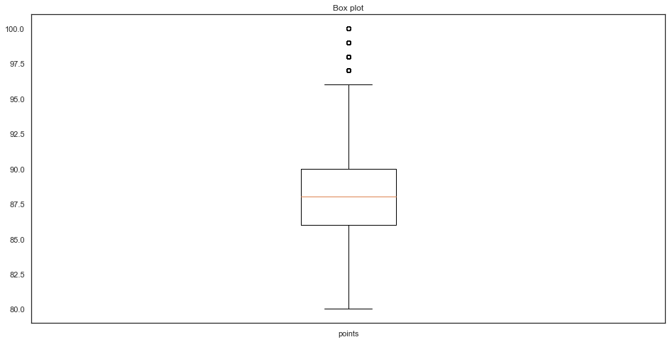
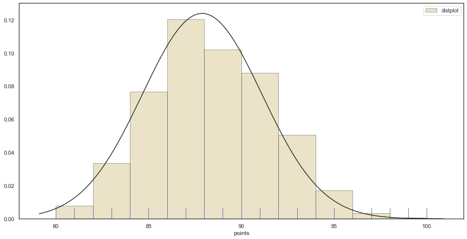
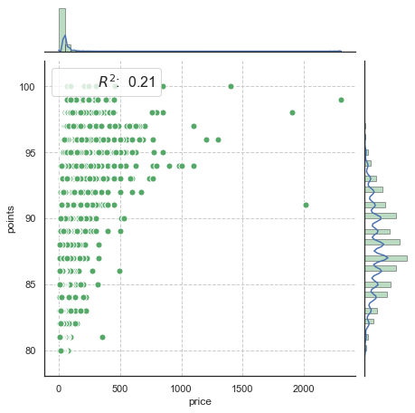
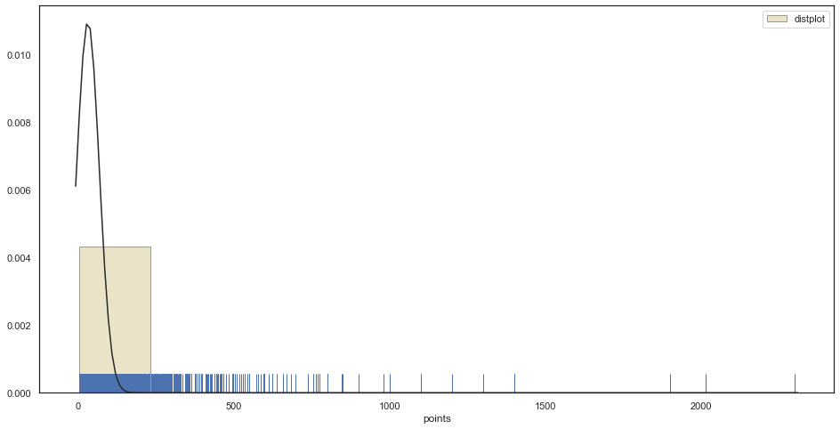
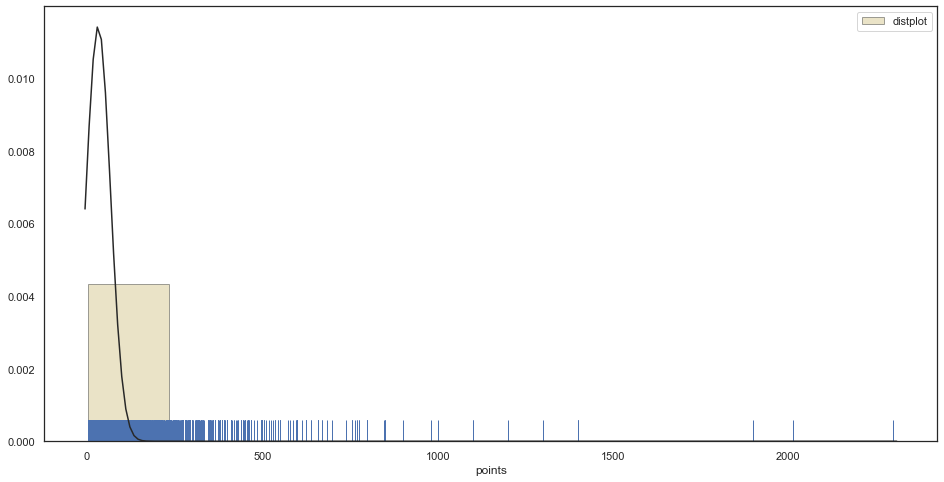
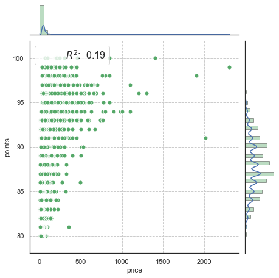
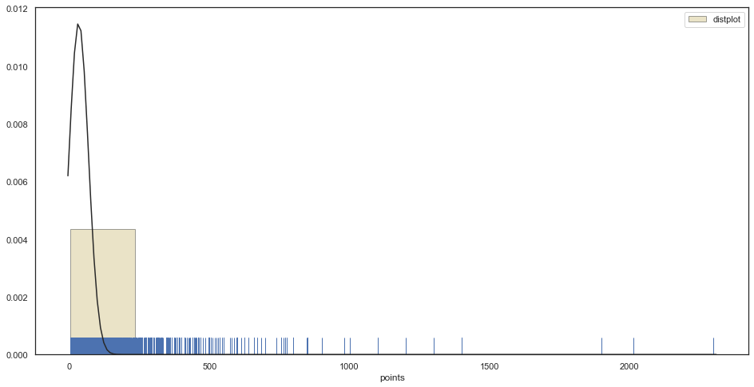
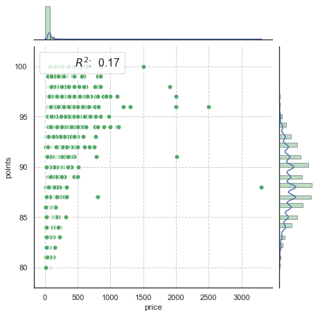
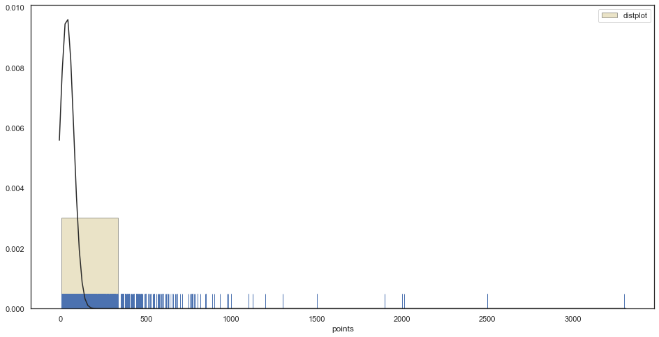

# 数据挖掘-Wine Reviews

## 数据可视化和摘要

### 属性摘要

- 标称属性, 给出每个可能聚会的频数
选择的标称属性有country,province, region_1, variety


```python
import csv
import warnings 
warnings.filterwarnings("ignore")
import seaborn as sns
import matplotlib.pyplot as plt
import pandas as pd
sns.set(style="white", color_codes=True)

# 读入数据
iris = pd.read_csv("./wine-reviews/winemag-data_first150k.csv") # the iris dataset is now a Pandas DataFrame


# 看下数据前5行
print(iris.keys())

```

    Index(['Unnamed: 0', 'country', 'description', 'designation', 'points',
           'price', 'province', 'region_1', 'region_2', 'variety', 'winery'],
          dtype='object')


**选择的标称属性有country,province, region_1, variety**


```python
def DataFrequency(Data,columns):
    #country
    DataFrequencyDir={}
    def frequency(attributes):
        DataFrequencyDir[attributes] = {}
        for item in Data[attributes]:
            if item not in DataFrequencyDir[attributes].keys():
                DataFrequencyDir[attributes][item]=1
            else:
                DataFrequencyDir[attributes][item]+=1
        DataFrequencyDir[attributes] = sorted(DataFrequencyDir[attributes].items(), key=lambda d: d[1],reverse=True)
    for col in columns:
        frequency(col)


    #标称变量的频数统计结果整体保存为json对象
    #print json.dumps(nominalDataFrequency,indent=1)
    #保存结果
    return DataFrequencyDir
```


```python
columns = ["country","province", "region_1", "variety"]
Winedata = DataFrequency(iris,columns)
```

由于数据量很大，只显示了各属性排名前十的


```python
import json
fileIn=open(r"WineDataFrequency.json",'w')
data_save=json.dumps(Winedata,indent=1)
fileIn.write(data_save)
for col in columns: 
    print("==================")
    for i in range(10): 
          
        print(Winedata[col][i])

```

    ==================
    ('US', 54504)
    ('France', 22093)
    ('Italy', 19540)
    ('Spain', 6645)
    ('Portugal', 5691)
    ('Chile', 4472)
    ('Argentina', 3800)
    ('Austria', 3345)
    ('Australia', 2329)
    ('Germany', 2165)
    ==================
    ('California', 36247)
    ('Washington', 8639)
    ('Bordeaux', 5941)
    ('Tuscany', 5897)
    ('Oregon', 5373)
    ('Burgundy', 3980)
    ('Northern Spain', 3851)
    ('Piedmont', 3729)
    ('Mendoza Province', 3264)
    ('Veneto', 2716)
    ==================
    ('', 21247)
    ('Napa Valley', 4480)
    ('Columbia Valley (WA)', 4124)
    ('Russian River Valley', 3091)
    ('California', 2629)
    ('Paso Robles', 2350)
    ('Willamette Valley', 2301)
    ('Mendoza', 2301)
    ('Alsace', 2163)
    ('Champagne', 1613)
    ==================
    ('Pinot Noir', 13272)
    ('Chardonnay', 11753)
    ('Cabernet Sauvignon', 9472)
    ('Red Blend', 8946)
    ('Bordeaux-style Red Blend', 6915)
    ('Riesling', 5189)
    ('Sauvignon Blanc', 4967)
    ('Syrah', 4142)
    ('Rosé', 3564)
    ('Merlot', 3102)


- 数值属性, 给出5数概括及缺失值的个数

**选取的数值属性有point 和 prince**


```python
import numpy as np
#五数分布
def fiveNumber(nums):
    nums.sort()
    # 五数概括 Minimum（最小值）、Q1、Median（中位数、）、Q3、Maximum（最大值）
    Minimum = min(nums)
    Maximum = max(nums)
    Q1 = np.percentile(nums, 25)
    Median = np.median(nums)
    Q3 = np.percentile(nums, 75)

    IQR = Q3-Q1
    lower_limit = Q1-1.5*IQR  # 下限值
    upper_limit = Q3+1.5*IQR  # 上限值

    return Minimum, Q1, Median, Q3, Maximum, lower_limit, upper_limit

def printfiveNumber(fivenumber):
    print("+++++++++++++++")
    print(f"Min = {fivenumber[0]}")
    print(f"Q1  = {fivenumber[1]}")
    print(f"Median = {fivenumber[2]}")
    print(f"Q3 = {fivenumber[3]}")
    print(f"Max = {fivenumber[4]}")
    print(f"lower_limit = {fivenumber[5]}")
    print(f"upper_limit = {fivenumber[6]}")
    print("+++++++++++++++")
```


```python
iris = pd.read_csv("./wine-reviews/winemag-data_first150k.csv", keep_default_na=False) # the iris dataset is now a Pandas DataFrame

miss_points = 0
miss_price = 0
points = iris["points"]
price = iris["price"]

for i in points:
    if i == "":
        miss_points+=1
for i in price:
    if i == "":
        miss_price+=1

# price[price == ''] = 
points = [float(x) for x in points]

# points[points == 'nan'] = 100
# price[price == ''] = 1000
# for i in price:
#     print(i)
# # print(price)
         
fivenumber_wine_point = fiveNumber(points)

print("points")
printfiveNumber(fivenumber_wine_point)


```

    points
    +++++++++++++++
    Min = 80.0
    Q1  = 86.0
    Median = 88.0
    Q3 = 90.0
    Max = 100.0
    lower_limit = 80.0
    upper_limit = 96.0
    +++++++++++++++


```python
miss_points
```


    0


我们可以单到points中并没有数据缺失，所以我们直接绘制它的盒图和直方图


```python
def box_plot(all_data):
    all_data = np.array(all_data)
    fig = plt.figure(figsize=(16,8))

    plt.boxplot(all_data,notch=False, sym='o',vert=True)   # vertical box aligmnent  # vertical box aligmnent
    
    plt.xticks([1],["points"])
#     plt.xlabel('measurement x')
    t = plt.title('Box plot')
    plt.show()
```


```python
points_1 = np.array([points])
points_1 = points_1.transpose()
np.shape(points_1)
```


    (150930, 1)


```python
box_plot(points)
```





```python
from scipy.stats import norm #使用直方图和最大似然高斯分布拟合绘制分布rs = np. random. RandomState(50) #设置随机数种子
def dist(data):
    plt. figure(figsize=(16,8))

    sns.distplot(data, bins=10, hist=True, kde=False, norm_hist=False,rug=True, 
                 vertical=False,label= 'distplot',axlabel='points',hist_kws={'color':'y','edgecolor':'k'},fit=norm)

    #用标准正态分布拟合

    plt.legend()

    # plt.grid(linesty1e='--')

    plt.show()
```


```python
dist(points)
```





```python
miss_price
```


    13695


从上面的数据中我们可以看到，在price中有很多值缺失，所以我们将数据进行清理后进行处理

1. 将数据直接删除


```python
iris = pd.read_csv("./wine-reviews/winemag-data_first150k.csv", keep_default_na=False) # the iris dataset is now a Pandas DataFrame

points_del = iris["points"]
price_del = iris["price"]
for i in range(len(price_del)):
#     print(price_del[i])
    if price_del[i]=='':
        price_del.pop(i)
        points_del.pop(i)
price_del = [float(x) for x in price_del]
fivenumber_wine_prince = fiveNumber(price_del)
print("price")
printfiveNumber(fivenumber_wine_prince)
```

    price
    +++++++++++++++
    Min = 4.0
    Q1  = 16.0
    Median = 24.0
    Q3 = 40.0
    Max = 2300.0
    lower_limit = -20.0
    upper_limit = 76.0
    +++++++++++++++


```python
def plot(number_x,number_y,labels):
    import pandas as pd
    from scipy import stats
    data = np.array([number_x,number_y])
    data = data.transpose()
    data1 = pd.DataFrame(data,columns=labels)
    # print(data1)
    g = sns.JointGrid(x = labels[0], y = labels[1], data=data1, size=6.5,ratio=6)

    #创建一个绘图表格区域，设置好x、y对应数据

    g = g.plot_joint(plt.scatter,color="g", s=50, edgecolor= "white") #绘制散点图

    plt.grid(linestyle = '--') #设置网格线

    g.plot_marginals(sns.distplot, kde=True, hist_kws={'color':'g','edgecolor':'k'})#设置边缘图
    rsquare = lambda a, b: stats.pearsonr(a, b)[0] ** 2#自定义 统计函数

    g = g.annotate(rsquare, template="{stat}: {val: .2f}",stat="$R^2$", loc="upper left", fontsize=16) #设置注释

    plt.show()
```


```python
points_del = [float(x) for x in points_del]
plot(price_del,points_del,["price","points"])
```





```python
dist(price_del)
```





```python
counts = np.bincount(price_del)
print("众数为：%f" % np.argmax(counts))
arr_mean = np.mean(price_del)
print(f"平均值为：{arr_mean}")
```

    众数为：20.000000
    平均值为：33.13148249353299


2. 将缺失的值填充为众数


```python
iris = pd.read_csv("./wine-reviews/winemag-data_first150k.csv", keep_default_na=False) # the iris dataset is now a Pandas DataFrame


# points_del = iris["points"]
price_del = iris["price"]
for i in range(len(price_del)):
#     print(price_del[i])
    if price_del[i]=='':
        price_del[i] = 20
price_del = [float(x) for x in price_del]
fivenumber_wine_prince = fiveNumber(price_del)
print("price")
printfiveNumber(fivenumber_wine_prince)
```

    price
    +++++++++++++++
    Min = 4.0
    Q1  = 16.0
    Median = 22.0
    Q3 = 38.0
    Max = 2300.0
    lower_limit = -17.0
    upper_limit = 71.0
    +++++++++++++++


可以看到数据向左移动了一些


```python
# points_del = [float(x) for x in points_del]
plot(price_del,points_del,["price","points"])
```


```python
dist(price_del)
```





3. 使用平均数填充缺省值


```python
iris = pd.read_csv("./wine-reviews/winemag-data_first150k.csv", keep_default_na=False) # the iris dataset is now a Pandas DataFrame

price_del = iris["price"]
for i in range(len(price_del)):
#     print(price_del[i])
    if price_del[i]=='':
        price_del[i] = 31.94
price_del = [float(x) for x in price_del]
fivenumber_wine_prince = fiveNumber(price_del)
print("price")
printfiveNumber(fivenumber_wine_prince)
```

    price
    +++++++++++++++
    Min = 4.0
    Q1  = 16.0
    Median = 26.0
    Q3 = 38.0
    Max = 2300.0
    lower_limit = -17.0
    upper_limit = 71.0
    +++++++++++++++


整体的数据向右移动了一些


```python
points_del = iris["points"]
points_del = [float(x) for x in points_del]

plot(price_del,points_del,["price","points"])
```





```python
dist(price_del)
```





4. 通过数据对象之间的相似性来填补缺失值
通过一个数组，每个point值对应的price，当price出现空缺时就将该point值对应的price填充进去，如果没有这个值，就用众数表示


```python
iris = pd.read_csv("./wine-reviews/winemag-data_first150k.csv", keep_default_na=False) # the iris dataset is now a Pandas DataFrame

price_del = iris["price"]
points_del = iris["points"]
# points_del = [float(x) for x in points_del]
dir_point_price = {}
for i in range(len(points_del)):
    dir_point_price[points_del[i]] =  price_del[i]
for i in range(len(price_del)):
    if price_del[i] == '':
        if points_del[i] not in dir_point_price.keys():
            price_del[i] = 20
        else:
            price_del[i] = dir_point_price[points_del[i]]
price_del = [float(x) for x in price_del]
points_del = [float(x) for x in points_del]
fivenumber_wine_prince = fiveNumber(price_del)
print("price")
printfiveNumber(fivenumber_wine_prince)
print(dir_point_price)
```

    price
    +++++++++++++++
    Min = 4.0
    Q1  = 15.0
    Median = 24.0
    Q3 = 40.0
    Max = 2300.0
    lower_limit = -22.5
    upper_limit = 77.5
    +++++++++++++++
    {96: '185.0', 95: '100.0', 94: '25.0', 90: '15.0', 91: '20.0', 86: '9.0', 89: '38.0', 88: '11.0', 87: '65.0', 93: '65.0', 92: '38.0', 85: '8.0', 84: '24.0', 83: '14.0', 82: '15.0', 81: '10.0', 100: '245.0', 99: '245.0', 98: '110.0', 97: '345.0', 80: '13.0'}


```python
plot(price_del,points_del,["price","points"])
```


```python
dist(price_del)
```


**我们现在看一下已经处理过的数据是怎样的**


```python
iris = pd.read_csv("./wine-reviews/winemag-data-130k-v2.csv", keep_default_na=False) # the iris dataset is now a Pandas DataFrame

miss_points = 0
miss_price = 0
points = iris["points"]
price = iris["price"]

for i in points:
    if i == "":
        miss_points+=1
for i in price:
    if i == "":
        miss_price+=1
print(f"points 的 缺失个数为{miss_points}")
print(f"price  的 缺失个数为{miss_price}")


```

    points 的 缺失个数为0
    price  的 缺失个数为8996


说明该数据中将部分的数据进行了调整，我们看看去掉这些缺省值这组数据的5数分布


```python
points_del = iris["points"]
price_del = iris["price"]
for i in range(len(price_del)):
#     print(price_del[i])
    if price_del[i]=='':
        price_del.pop(i)
        points_del.pop(i)
price_del = [float(x) for x in price_del]
points = [float(x) for x in points]

# points[points == 'nan'] = 100
# price[price == ''] = 1000
# for i in price:
#     print(i)
# # print(price)
         
fivenumber_wine_point = fiveNumber(points)
print("points")
printfiveNumber(fivenumber_wine_point)
fivenumber_wine_prince = fiveNumber(price_del)
print("price")
printfiveNumber(fivenumber_wine_prince)

```

    points
    +++++++++++++++
    Min = 80.0
    Q1  = 86.0
    Median = 88.0
    Q3 = 91.0
    Max = 100.0
    lower_limit = 78.5
    upper_limit = 98.5
    +++++++++++++++
    price
    +++++++++++++++
    Min = 4.0
    Q1  = 17.0
    Median = 25.0
    Q3 = 42.0
    Max = 3300.0
    lower_limit = -20.5
    upper_limit = 79.5
    +++++++++++++++


```python
plot(price_del,points_del,["price","points"])
dist(price_del)
```








## 结论

从上述的各个图表中可以看出，将数据直接剔除对于数据的分布影响是很小的，葡萄酒的评分和价格并没有什么必然的关系，价格低的也有评分很高的。有一点可以的出，价钱高的酒评分不会低，便宜也有好货，好货也有可能便宜。


```python

```
