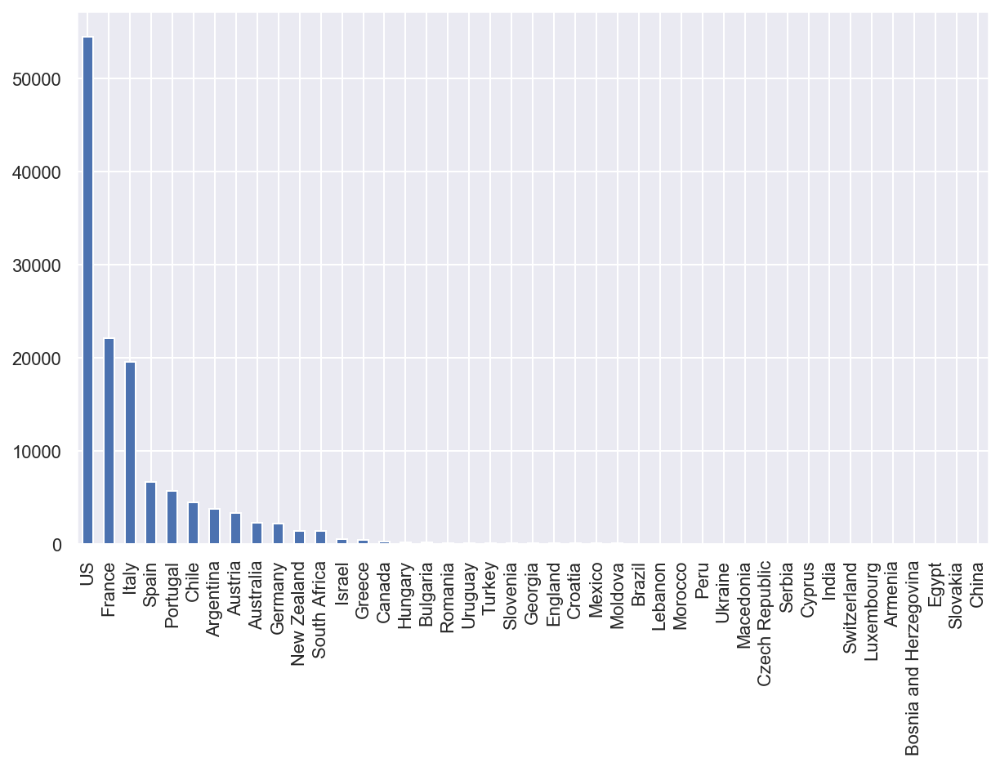
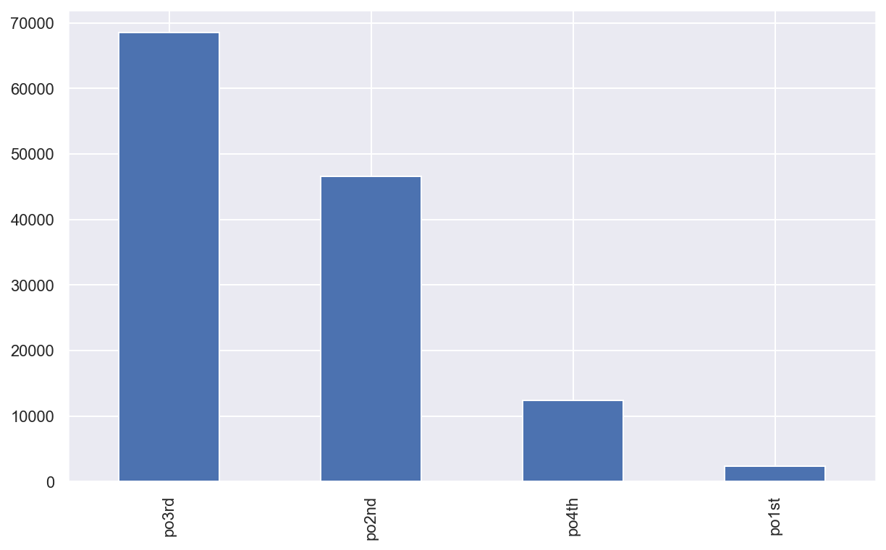
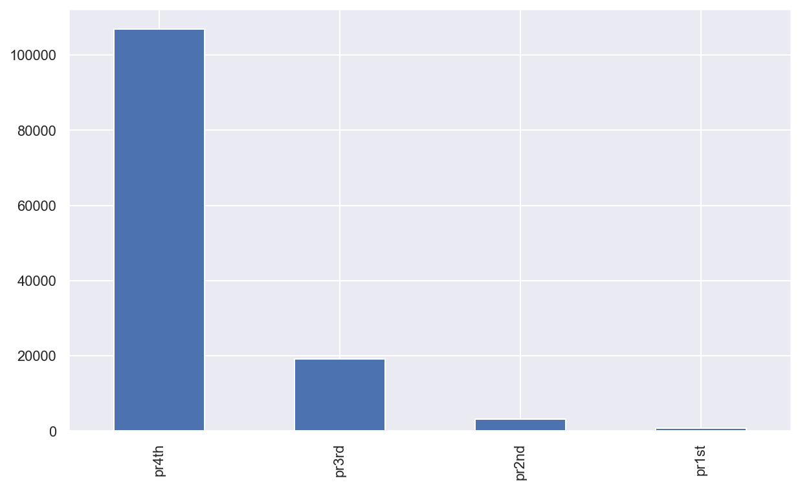
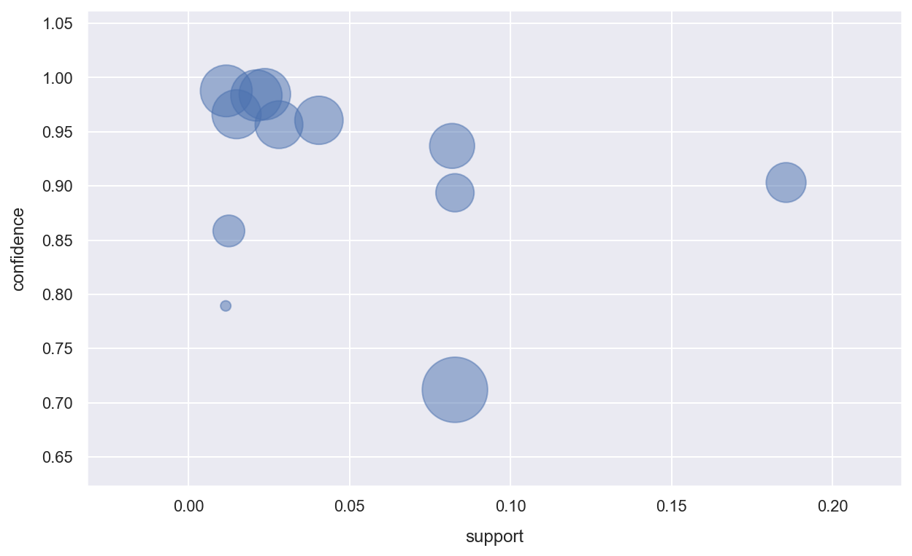
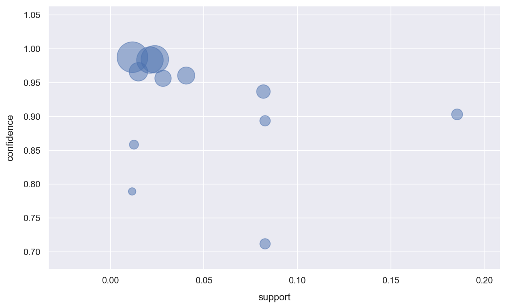

# 频繁模式与关联规则挖掘

使用了Wine Reviews数据集

```python
# Import modules
import numpy as np
import pandas as pd
import seaborn as sns
import bokeh as bk
from bokeh.io import output_notebook, show
output_notebook()
%matplotlib inline
import matplotlib.pyplot as plt
```


<div class="bk-root">
    <a href="https://bokeh.org" target="_blank" class="bk-logo bk-logo-small bk-logo-notebook"></a>
    <span id="1001">Loading BokehJS ...</span>
</div>


```python
# Ignore irrelevant warnings 
import warnings
warnings.filterwarnings('ignore')
```


```python
# 设置整体绘图打印样式
%config InlineBackend.figure_format='retina'
sns.set() 
plt.rcParams['figure.figsize'] = (10, 6)
plt.rcParams['axes.labelpad'] = 10
sns.set_style("darkgrid")
# sns.set_palette("Reds")
# sns.set_context("poster", font_scale=1.0)
```


```python
WinerDF = pd.read_csv("./wine-reviews/winemag-data-130k-v2.csv")
```


```python
WineData = pd.DataFrame(WinerDF,columns = ["country","points","price"])
```


```python
WineData.info()
```

    <class 'pandas.core.frame.DataFrame'>
    RangeIndex: 129971 entries, 0 to 129970
    Data columns (total 3 columns):
    country    129908 non-null object
    points     129971 non-null int64
    price      120975 non-null float64
    dtypes: float64(1), int64(1), object(1)
    memory usage: 3.0+ MB


```python
WineData.head()
```


<div>
<style scoped>
    .dataframe tbody tr th:only-of-type {
        vertical-align: middle;
    }

    .dataframe tbody tr th {
        vertical-align: top;
    }

    .dataframe thead th {
        text-align: right;
    }
</style>
<table border="1" class="dataframe">
  <thead>
    <tr style="text-align: right;">
      <th></th>
      <th>country</th>
      <th>points</th>
      <th>price</th>
    </tr>
  </thead>
  <tbody>
    <tr>
      <td>0</td>
      <td>Italy</td>
      <td>87</td>
      <td>NaN</td>
    </tr>
    <tr>
      <td>1</td>
      <td>Portugal</td>
      <td>87</td>
      <td>15.0</td>
    </tr>
    <tr>
      <td>2</td>
      <td>US</td>
      <td>87</td>
      <td>14.0</td>
    </tr>
    <tr>
      <td>3</td>
      <td>US</td>
      <td>87</td>
      <td>13.0</td>
    </tr>
    <tr>
      <td>4</td>
      <td>US</td>
      <td>87</td>
      <td>65.0</td>
    </tr>
  </tbody>
</table>
</div>


## 分析规则
为了使得该数据集适用于关联规则挖掘，我们对数据进行了一下简单的重构。对于数值属性“points”,“price”进行离散化处理。根据数值的大小，将他们分别分为四个等级，表示评分的高低及价格的高低。并将离散后的数据转换为适用于Apriori算法处理的transactions类型。


```python
WineData['points'].describe()
```


    count    129971.000000
    mean         88.447138
    std           3.039730
    min          80.000000
    25%          86.000000
    50%          88.000000
    75%          91.000000
    max         100.000000
    Name: points, dtype: float64


```python
WineData['price'].describe()
```


    count    120975.000000
    mean         35.363389
    std          41.022218
    min           4.000000
    25%          17.000000
    50%          25.000000
    75%          42.000000
    max        3300.000000
    Name: price, dtype: float64


```python
for i in range(len(WineData['points'])):
#     print(type(i))
    if WineData['points'][i] >= 95:
        WineData['points'][i] = "po1st"
    elif WineData['points'][i] >= 90:
        WineData['points'][i] = "po2nd"
    elif WineData['points'][i] >= 85:
        WineData['points'][i] = "po3rd"
    else:
        WineData['points'][i] = "po4th"
```


```python
for i in range(len(WineData['price'])):
#     print(type(i))
    if WineData['price'][i] >= 200:
        WineData['price'][i] = "pr1st"
    elif WineData['price'][i] >= 100:
        WineData['price'][i] = "pr2nd"
    elif WineData['price'][i] >= 50:
        WineData['price'][i] = "pr3rd"
    else:
        WineData['price'][i] = "pr4th"
```


```python
WineData.head()
```


<div>
<style scoped>
    .dataframe tbody tr th:only-of-type {
        vertical-align: middle;
    }

    .dataframe tbody tr th {
        vertical-align: top;
    }

    .dataframe thead th {
        text-align: right;
    }
</style>
<table border="1" class="dataframe">
  <thead>
    <tr style="text-align: right;">
      <th></th>
      <th>country</th>
      <th>points</th>
      <th>price</th>
    </tr>
  </thead>
  <tbody>
    <tr>
      <td>0</td>
      <td>Italy</td>
      <td>po3rd</td>
      <td>pr4th</td>
    </tr>
    <tr>
      <td>1</td>
      <td>Portugal</td>
      <td>po3rd</td>
      <td>pr4th</td>
    </tr>
    <tr>
      <td>2</td>
      <td>US</td>
      <td>po3rd</td>
      <td>pr4th</td>
    </tr>
    <tr>
      <td>3</td>
      <td>US</td>
      <td>po3rd</td>
      <td>pr4th</td>
    </tr>
    <tr>
      <td>4</td>
      <td>US</td>
      <td>po3rd</td>
      <td>pr3rd</td>
    </tr>
  </tbody>
</table>
</div>


```python
WineData["country"].value_counts().plot.bar()
```


    <matplotlib.axes._subplots.AxesSubplot at 0x137cb8d10>





```python
WineData["points"].value_counts().plot.bar()
```


    <matplotlib.axes._subplots.AxesSubplot at 0x137efb3d0>





```python
WineData["price"].value_counts().plot.bar()
```


    <matplotlib.axes._subplots.AxesSubplot at 0x1335fea10>





将Pandas DataFrame转换为列表


```python
records = WineData.to_records(index=False)
result = list(records)
```


```python
result[0:10]
```


    [('Italy', 'po3rd', 'pr4th'),
     ('Portugal', 'po3rd', 'pr4th'),
     ('US', 'po3rd', 'pr4th'),
     ('US', 'po3rd', 'pr4th'),
     ('US', 'po3rd', 'pr3rd'),
     ('Spain', 'po3rd', 'pr4th'),
     ('Italy', 'po3rd', 'pr4th'),
     ('France', 'po3rd', 'pr4th'),
     ('Germany', 'po3rd', 'pr4th'),
     ('France', 'po3rd', 'pr4th')]


```python
from efficient_apriori import apriori
```


```python
rules = apriori(result, min_support=0.01, min_confidence=0.7)
print(rules)  
```

    ({1: {('Italy',): 19540, ('po3rd',): 68496, ('pr4th',): 106863, ('Portugal',): 5691, ('US',): 54504, ('pr3rd',): 19157, ('Spain',): 6645, ('France',): 22093, ('Germany',): 2165, ('Argentina',): 3800, ('Chile',): 4472, ('pr2nd',): 3175, ('Australia',): 2329, ('Austria',): 3345, ('po2nd',): 46629, ('South Africa',): 1401, ('New Zealand',): 1419, ('po4th',): 12430, ('po1st',): 2416}, 2: {('Italy', 'po3rd'): 12032, ('Italy', 'pr4th'): 15105, ('po3rd', 'pr4th'): 63313, ('Portugal', 'po3rd'): 3132, ('Portugal', 'pr4th'): 5152, ('US', 'po3rd'): 26697, ('US', 'pr4th'): 43256, ('US', 'pr3rd'): 9932, ('po3rd', 'pr3rd'): 4745, ('Spain', 'po3rd'): 3820, ('Spain', 'pr4th'): 5905, ('France', 'po3rd'): 11354, ('France', 'pr4th'): 18336, ('Germany', 'pr4th'): 1724, ('Argentina', 'po3rd'): 2011, ('Argentina', 'pr4th'): 3432, ('Chile', 'po3rd'): 2790, ('Chile', 'pr4th'): 4213, ('France', 'pr3rd'): 2655, ('Australia', 'pr4th'): 1887, ('Austria', 'pr4th'): 2976, ('Italy', 'pr3rd'): 3664, ('France', 'po2nd'): 8527, ('po2nd', 'pr3rd'): 13133, ('Italy', 'po2nd'): 6302, ('US', 'po2nd'): 21332, ('po2nd', 'pr4th'): 30918, ('po2nd', 'pr2nd'): 2226, ('Portugal', 'po2nd'): 1908, ('Spain', 'po2nd'): 1545, ('Austria', 'po2nd'): 1901, ('po4th', 'pr4th'): 12132, ('France', 'po4th'): 1547, ('US', 'po4th'): 5482}, 3: {('Italy', 'po3rd', 'pr4th'): 10753, ('Portugal', 'po3rd', 'pr4th'): 3084, ('US', 'po3rd', 'pr4th'): 24112, ('US', 'po3rd', 'pr3rd'): 2431, ('Spain', 'po3rd', 'pr4th'): 3654, ('France', 'po3rd', 'pr4th'): 10638, ('Argentina', 'po3rd', 'pr4th'): 1943, ('Chile', 'po3rd', 'pr4th'): 2744, ('France', 'po2nd', 'pr3rd'): 1857, ('Italy', 'po2nd', 'pr3rd'): 2349, ('US', 'po2nd', 'pr4th'): 13701, ('France', 'po2nd', 'pr4th'): 5967, ('US', 'po2nd', 'pr3rd'): 6741, ('Italy', 'po2nd', 'pr4th'): 3471, ('Portugal', 'po2nd', 'pr4th'): 1506, ('Austria', 'po2nd', 'pr4th'): 1632, ('France', 'po4th', 'pr4th'): 1528, ('US', 'po4th', 'pr4th'): 5266}}, [{Italy} -> {pr4th}, {po3rd} -> {pr4th}, {Portugal} -> {pr4th}, {US} -> {pr4th}, {Spain} -> {pr4th}, {France} -> {pr4th}, {Germany} -> {pr4th}, {Argentina} -> {pr4th}, {Chile} -> {pr4th}, {Australia} -> {pr4th}, {Austria} -> {pr4th}, {pr2nd} -> {po2nd}, {po4th} -> {pr4th}, {Italy, pr4th} -> {po3rd}, {Italy, po3rd} -> {pr4th}, {Portugal, po3rd} -> {pr4th}, {US, po3rd} -> {pr4th}, {Spain, po3rd} -> {pr4th}, {France, po3rd} -> {pr4th}, {Argentina, po3rd} -> {pr4th}, {Chile, po3rd} -> {pr4th}, {Portugal, po2nd} -> {pr4th}, {Austria, po2nd} -> {pr4th}, {France, po4th} -> {pr4th}, {US, po4th} -> {pr4th}])


根据关联结果中的提升度(life)进行降序排序。
上面满足支持度阈值和置信度阈值的规则存在冗余规则，冗余规则的定义是：如果rules2的lhs和rhs是包含于rules1的，而且rules2的lift小于或者等于rules1，则称rules2是rules1的冗余规则。下面对冗余规则进行删除，最终关联规则精简到11条。


```python
itemsets, rules = apriori(result, min_support=0.01, min_confidence=0.7)

# Print out every rule with 2 items on the left hand side,
# 1 item on the right hand side, sorted by lift
rules_rhs = filter(lambda rule:  len(rule.lhs) == 2 and len(rule.rhs) == 1, rules)
i = 0
for rule in sorted(rules_rhs, key=lambda rule: rule.lift,reverse = True):
    print(str(i)+":",end="")
    print(rule)  # Prints the rule and its confidence, support, lift, ...
    i+=1
```

    0:{Italy, pr4th} -> {po3rd} (conf: 0.712, supp: 0.083, lift: 1.351, conv: 1.642)
    1:{France, po4th} -> {pr4th} (conf: 0.988, supp: 0.012, lift: 1.201, conv: 14.476)
    2:{Portugal, po3rd} -> {pr4th} (conf: 0.985, supp: 0.024, lift: 1.198, conv: 11.601)
    3:{Chile, po3rd} -> {pr4th} (conf: 0.984, supp: 0.021, lift: 1.196, conv: 10.784)
    4:{Argentina, po3rd} -> {pr4th} (conf: 0.966, supp: 0.015, lift: 1.175, conv: 5.258)
    5:{US, po4th} -> {pr4th} (conf: 0.961, supp: 0.041, lift: 1.168, conv: 4.512)
    6:{Spain, po3rd} -> {pr4th} (conf: 0.957, supp: 0.028, lift: 1.163, conv: 4.091)
    7:{France, po3rd} -> {pr4th} (conf: 0.937, supp: 0.082, lift: 1.140, conv: 2.819)
    8:{US, po3rd} -> {pr4th} (conf: 0.903, supp: 0.186, lift: 1.098, conv: 1.836)
    9:{Italy, po3rd} -> {pr4th} (conf: 0.894, supp: 0.083, lift: 1.087, conv: 1.673)
    10:{Austria, po2nd} -> {pr4th} (conf: 0.858, supp: 0.013, lift: 1.044, conv: 1.256)
    11:{Portugal, po2nd} -> {pr4th} (conf: 0.789, supp: 0.012, lift: 0.960, conv: 0.844)


## 可视化


```python
rules_rhs = filter(lambda rule:  len(rule.lhs) == 2 and len(rule.rhs) == 1, rules)
support = []
confidence = []
lift = []
conviction = []
for rule in sorted(rules_rhs, key=lambda rule: rule.lift,reverse = True):
    support.append(rule.support)
    confidence.append(rule.confidence)
    lift.append((rule.lift-0.95)*5000)
    conviction.append(rule.conviction*100)
```


```python
import random
import matplotlib.pyplot as plt
fig = plt.figure()
ax = plt.subplot()
ax.scatter(support, confidence, s=lift, alpha=0.5)  # 绘制散点图，
plt.xlabel('support')
plt.ylabel('confidence') 
plt.show()
```





圆圈的面积代表lift的大小


```python
fig = plt.figure()
ax = plt.subplot()
ax.scatter(support, confidence, s=conviction, alpha=0.5)  # 绘制散点图，
plt.xlabel('support')
plt.ylabel('confidence') 
plt.show()
```





圆圈的面积代表确信度（conviction）的大小
